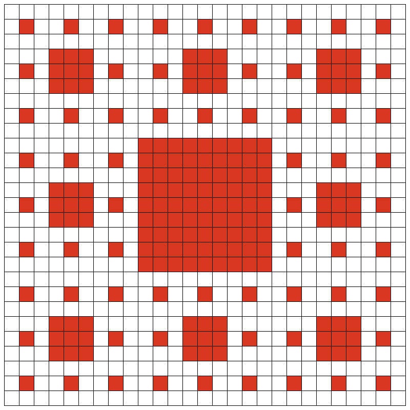
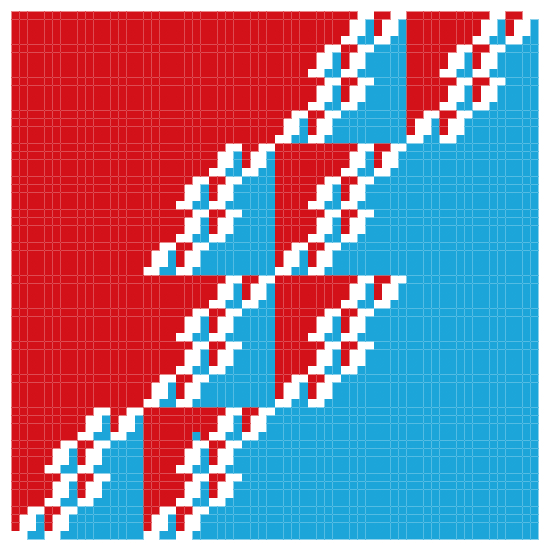

## Motivation
Fractal geometry is a relatively new field of mathematics that is not traditionally taught in high school classrooms. Due to this fact, there aren't many tools out there for teachers to use who want to explore this topic with younger students. My partner is a high school teacher who is lucky enough to teach a course that includes fractals and she was looking for an easy way for students to be able to manually explore the concepts of iteration, self similarity, and fractal dimension. Together we worked to design this application that would serve as an important learning tool for her students.

 

## Development
My partner previously used a word processor to create tables and fill in the indivdual cells to create her fractal designs for students, but found the process very tedious and limiting. It was important for her that we make a system that allowed the grid to be created with any number of cells, while still making it easy to share and print the finalized designs for her classroom. We wanted students to be able see their designs with and without the grid lines, and have freedom with choosing color options.

## Tech Stack
The application uses the HTML5 canvas to provide an accessible drawing interface for students with a native color picker for their shading choices. The entire application is written in vanilla javascript with no framework, and uses the Bulma CSS library for responsive styling. The grid state saves itself to local browser storage after every shading operation and loads itself automatically when returning to the page to ensure no one loses work. I chose one of the many available PDF libraries to allow users to download their grid to fill a standard 8.5x11 sheet of paper for printing. Due to the fact that it's built with all front end technology, I was able to host it on Firebase hosting.