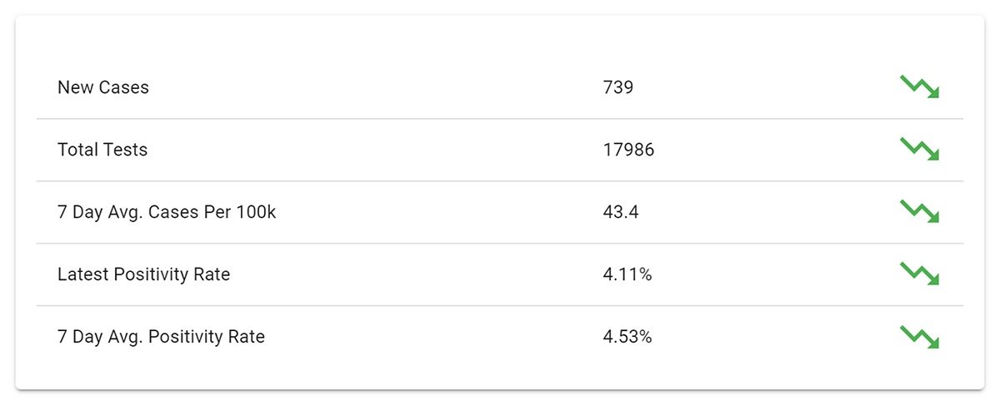
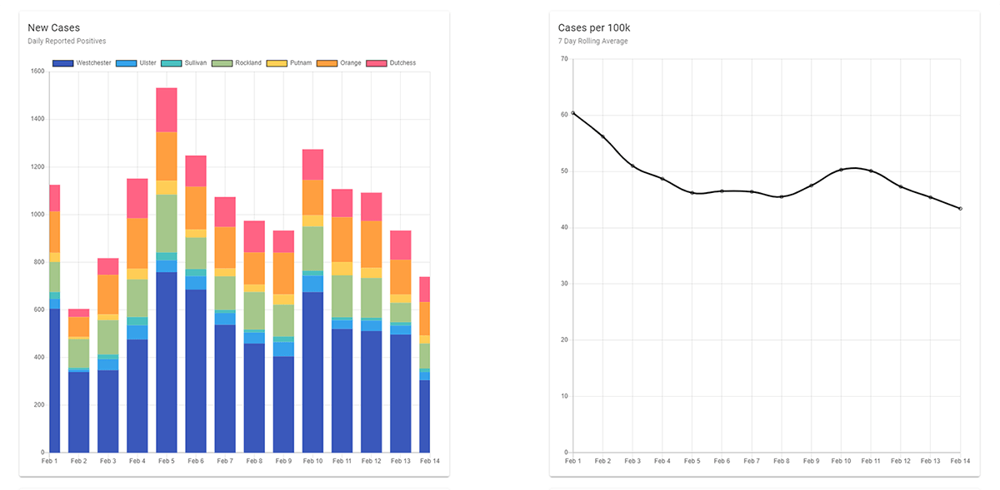
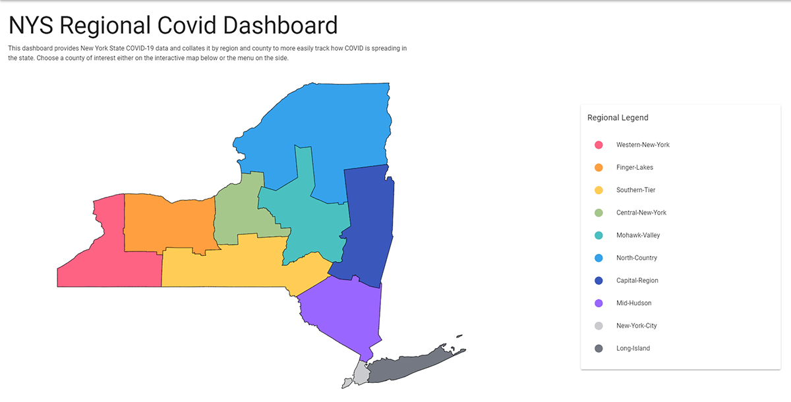

## Motivation
The goal of this project was to provide a better view of the COVID regional data in New York State. Other dashboards provide county level statistics, however the state was making decisions surrounding lock-downs based on regions. At the school where I worked, we needed to better track regional data to understand our plans for in person learning. I created this dashboard to track important metrics considering for state restrictions such as Number of Cases per 100k and Average Percent Positive as well as Daily New Cases and Daily Percent Positive. 

## Development
Initially this application was built only for the region where the school is located, however I expanded its scope to include all regions of the state as I realized it may prove useful to others. I am pulling the data directly from the New York State Department of Health's official COVID API so I can ensure the data is always up to date and I do not have to maintain a database. 

## Tech Stack
I built this application using Vue.js as a front-end framework to easily create reusable components across the site for each of the locations, as well as to more easily handle the routing and state management of the application. The charts are all built using ChartJS, a library which allows for great customization and reactivity. The homepage map is made with linked svg paths that I modified to show the regions used by the state during this time.

