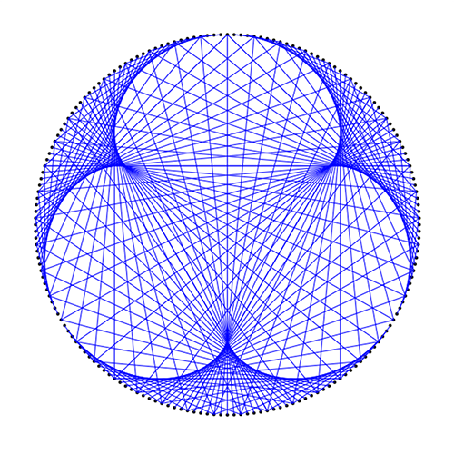
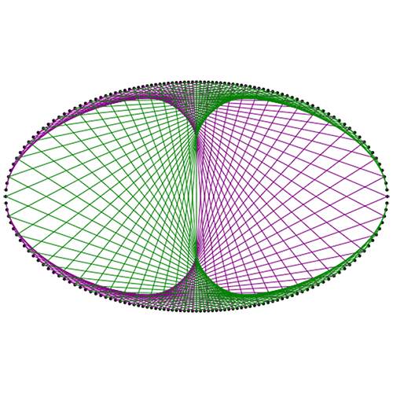

## Motivation
Combining art with math and science is a growing trend in education sometimes referred to as STEAM. This simulation grew out of a unit in which my partner teaches her students about modular division and its various applications. 

Modular division is a special form division where the result of the operation is the remainder. This form of division has applications from barcodes, credit card validation algorithms, and even art. 

Her students learned how to create these special cardiods by using an algorithm that incorperates modular division. You start by punching holes into a paper in a circle (or other shape if you like) and spacing them evenly apart and assigning each hole a number. Then based on a formula (with modular division) you plug in each hole's number and it tells you which hole to connect with your string. By connecting these holes you can create beautiful curved shapes by only using straight lines. This process seems almost magical and it can be hard for students to be able to envision their final product. I built this tool to help them design their art before they started sewing them in real life.

## Development
I wanted to be able to let students choose between a circle and an oval for their shape as well as control different aspects of the formula such as the number of holes used or the color(s) of the string. I had to brush up on polar coordinate systems and the trig formulas for these shapes to easily distribute the nodes on both the circle and oval easily.

## Tech Stack
I rendered the string art itself on the HTML5 canvas, using Vue.js as my framework to create the reactive UI. I used Bulma's CSS bindings for Vue to style the components and make them responsive and accessible. Due to the number of parameters being passed around and changed, I chose to use Typescript to write my code in class style components for added type safety. The app is front end only hosted on Firebase hosting.