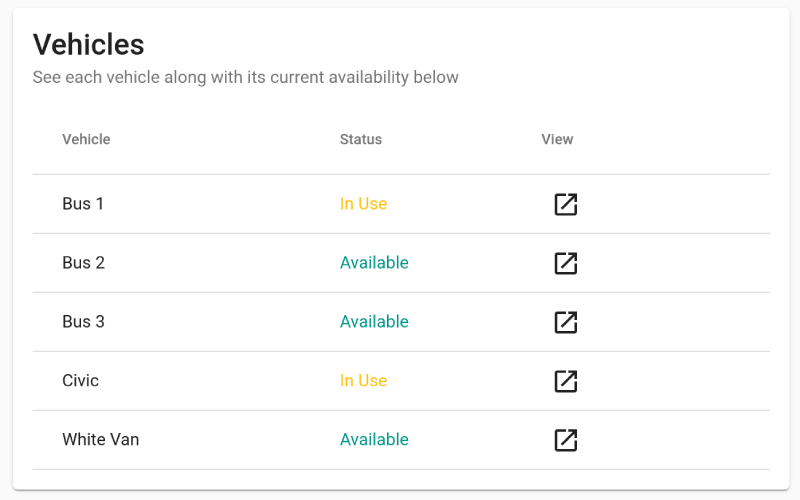
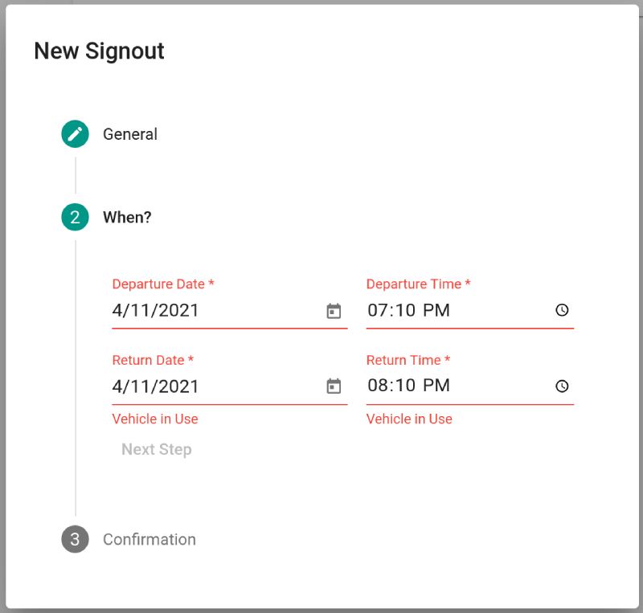

*Demo Credentials:*

- User: testuser@seandickinson.dev
- Password: VehicleTest!

## Motivation

This project is a real-time sign out application made to handle the sharing of vehicles on a school campus. This project was made for the school I work at to replace the paper sign out sheet and to better allow visibility and tracking of the use of the shared vehicles.

Many small boarding schools supply their own transportation for their boarding students for activities and sports. As such, they tend to have a small fleet of vans, buses, and other vehicles that faculty can use to transport the students to their destinations. This application aimed to make it easy for the use of these vehicles to be monitored and scheduled so that faculty didn't take a vehicle that was needed for another use or was out for maintenance.

## Development

This project required not only a database to store the signouts, but also the ability to see the status of vehicles in real-time and address potential conflicts. To accommodate these needs, I used real-time listeners and the Cloud Firestore database offered by Google's Firebase service.

The real-time database ensured that users always saw new signouts appear, however it was not enough to track the status of the vehicles to see what is available at present. To solve this problem I used a web worker on the client side to update the current time and filter the results from the database using that time. I chose to use a web worker so as to not use resources in the main thread of the application and to provide more accurate time. This decision allowed me to keep much of the filtering of data on the client side and avoid unnecessary reads to the database.

## Tech Stack

This application is built using Angular as a front-end framework and it uses Google's official Angular Components library with reusable Material Design components. I also make use of the official Angular library for Firebase to more easily handle the real-time listeners and authentication with route guards. Due to its use of Firebase's BaaS model, this application is hosted via a static front-end on Firebase hosting.
